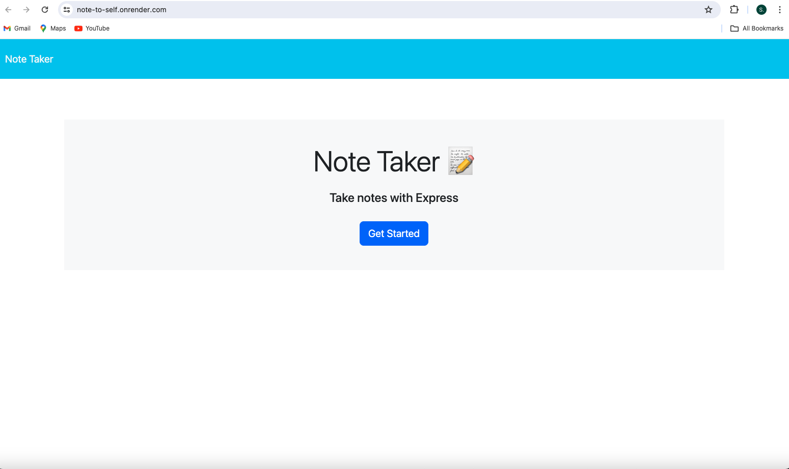
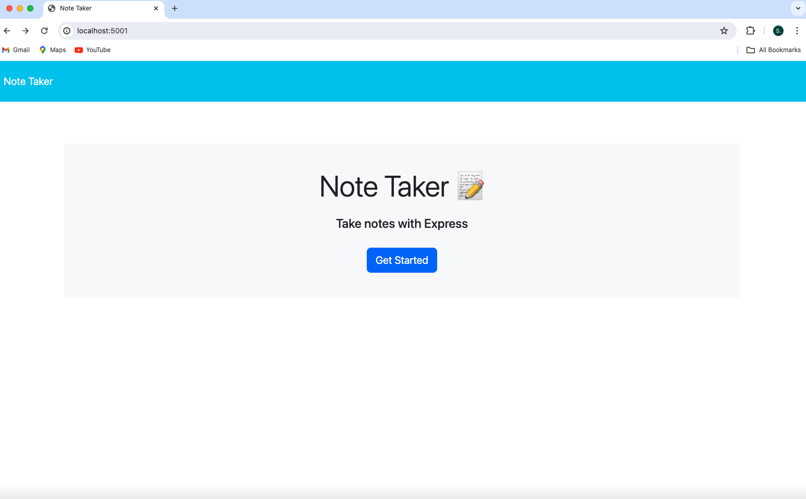
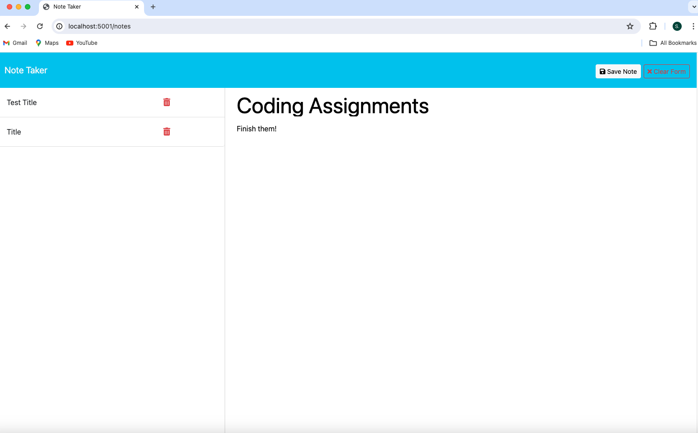
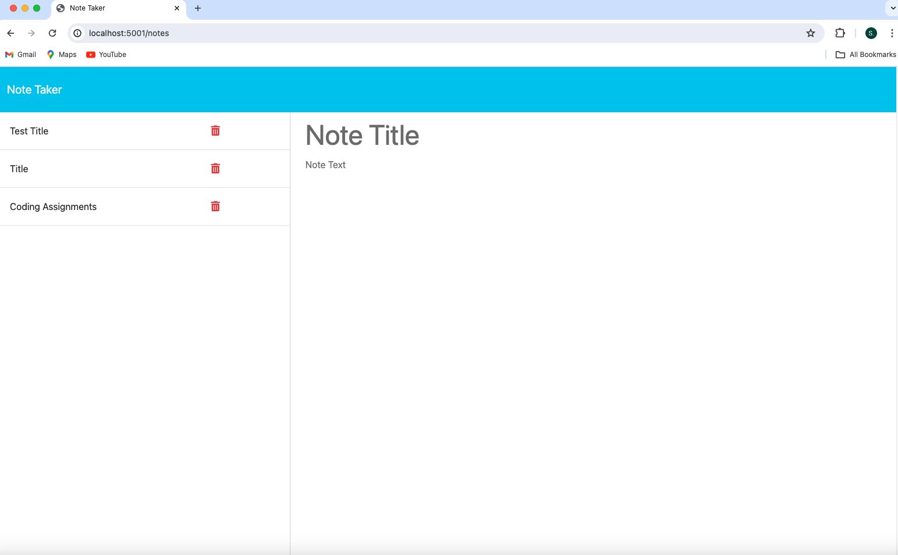
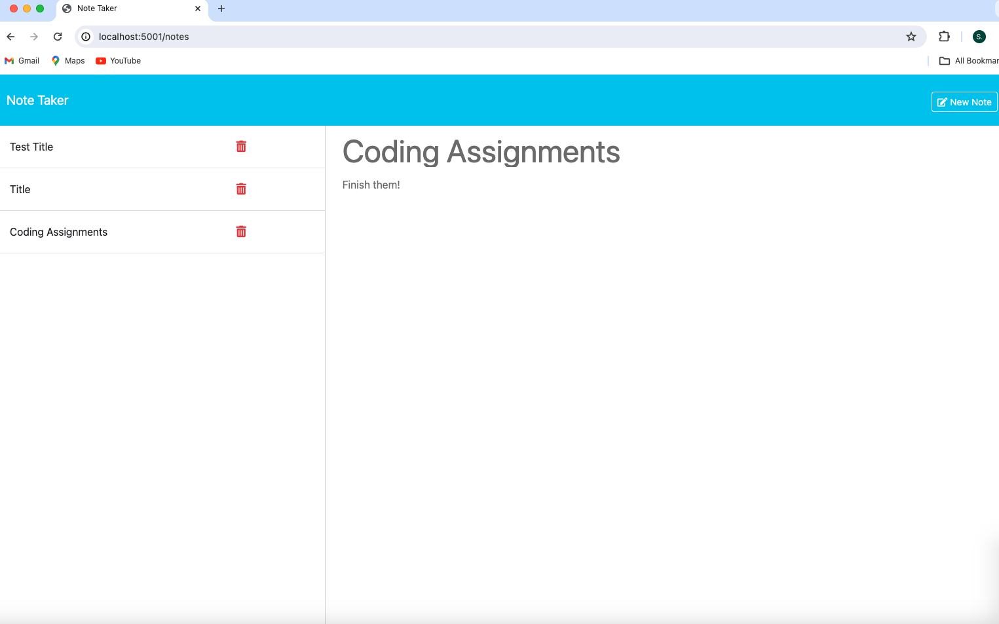

# note-to-self
An Express Note Taker Application 

## Table of Contents
- [Description](#description)
- [Installation](#installation)
- [Usage](#usage)
- [Live Link](#live-link)
- [Screenshots](#screenshots)
- [License](#license)
- [Credits](#credits) 

## Description
- The motivation for this project was to create a note taker application for a small business owner, or anyone for that matter, myself included, to be able to write and save notes. I personally like to write notes and do so everyday so this application will be very useful. 
- The application uses an Express.js back end that saves and retrieves note data from a JSON file. The File System module is utilized to read and write from the 'db.json' file and it is deployed through Render.
- There were mostly challenges with this application due to the wild card, which was placed in the server.js file incorrectly. I initially had this piece of code (now on lines 62 to 64) before the api routes and it was trying to read the index.html file as JSON. After much code work, I finally realized the issue and once moved the application worked in the browser. 
- Another challenge with the project was time, as with many challenges assignments, and while I was planning on working on the delete route, I ran out of time. 
- I learned a lot while working on this project, especially about the placement of a wild card, but also deploying an application through Render. I also solidified my understanding of POST routes, while trying to consolidate the code as much as possible. 

## Installation
- Clone the repository to your local environment
- Node.js is required for this application so run the 'node -v' command in the terminal to check your version and otherwise refer the the nodejs.org for installation
- Run the 'npm i' command in the terminal to install the necessary dependencies

## Usage
- To use this application run the command 'node server.js in the terminal. 
- Open the browser and enter http://localhost:3001/ to run this application on your local machine (granted that the PORT is 3001). 
- No authentications, like passwords or logins, are required to use this application. 
- A user can also visit the deployed live application on Render

## Live Link 
https://note-to-self.onrender.com

## Screenshots 

## License
- There is no license for this project. 

## Credits 

Aggarwal, G. (2022, May 23). NPM packages to generate unique ID's for your next project. Dev Community. https://dev.to/gulshanaggarwal/npm-packages-to-generate-unique-ids-for-your-next-project-1p3b

Calle, T. (2023). Thomas Express JS Note Taker. GitHub [Source Code]. https://github.com/ThomasCalle/Thomas-Express-JS-Note-Taker.git

Li, S. (2022). Note Taker. GitHub [Scource Code]. https://github.com/siennameow/note-taker.git

Martina, N. (2020, January 17). Simple note-taking app using Node.js and EJS. Medium. https://medium.com/@nnamani.ezinne/simple-note-taking-app-using-node-js-and-ejs-4899321a3342

Tigalo, J. (2022). Notabilis. GitHub [Source Code]. https://github.com/jbtiglao/notabilis.git

University of Toronto. (2023). Coding Boot Camp [Source Code].

Lajara, D. (2022). Note Taker. GitHub [Source Code]. https://github.com/juanlajara/Note-Taker/blob/master/routes/apiRoutes.js

